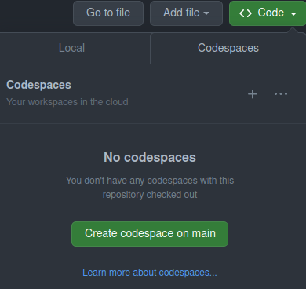
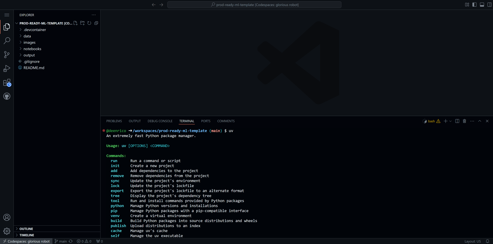
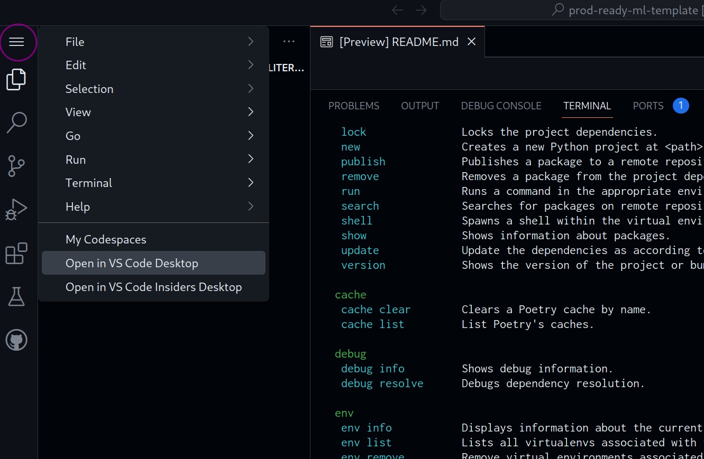

# Production Ready Machine Learning

Hi! 👋🏻

This repository contains the material needed for the **Production Ready Machine Learning** training.

Since you're reading this, it means you've successfully gained access to this repo 🎉. Now let's get you all setup for the training.

## Getting Started

We advise to walk through the following steps ***before*** the actual training, so we can catch any potential problems in time.
If you run into problems, please contact your trainer, so that he/she can help out.

To follow this training you have two options:

### Following the training locally

If you are comfortable managing your local Python and uv installations, you can follow the training using your own setup and the editor of your choice.

You need to:
1. Clone (you need to clone via ssh) or download this repo.
2. Install `uv`. See here for instructions: https://docs.astral.sh/uv/getting-started/installation/
3. Install Python using `uv` with the Python version being >=3.10 (we recommend 3.11.6, as this will be the pinned version in the codespaces). You can use these commands: `uv python install 3.11.6` and `uv python pin 3.11.6`.

### Using Codespaces

Alternatively, we provide a _devcontainer_ that spins up a virtual environment with everything ready for the training using VS code as an editor.
The steps to set this up are:

1. ✅ Access the repository
2. Open or create a _codespace_ on the `main` branch. This will open a new browser tab with a browser version of VS code.

   > [Codespaces](https://docs.github.com/en/codespaces/overview) allow you to work on a repository on a computer other than your own, saving you from the trouble of setting everything up yourself.

It can take a few minutes to set up, but eventually you will be able to check that everything is ready by typing `uv` into the terminal.

3. (Optional) If you have VS Code installed in your computer, you can access the _codespace_ in your desktop editor. To do so, click the "Open in VS Code Desktop" option in the top-right menu under the _three horizontal bars_ icon. You might get a pop-up prompting you to install some extensions (e.g. for python, jupyter) if they are not already installed.

That's it! You should be all setup now. If you are using VS Code desktop you can close the browser-based VS code tab.

## About

Xebia Data (c) 2025.
